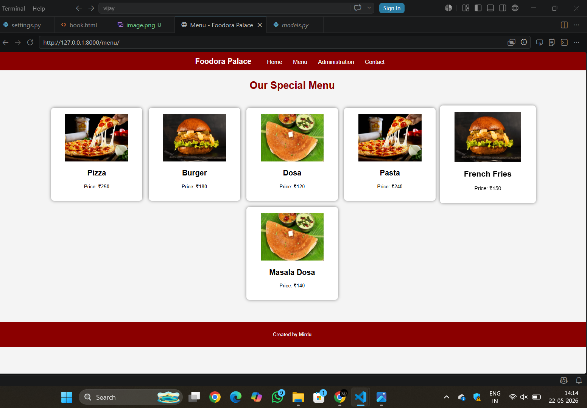
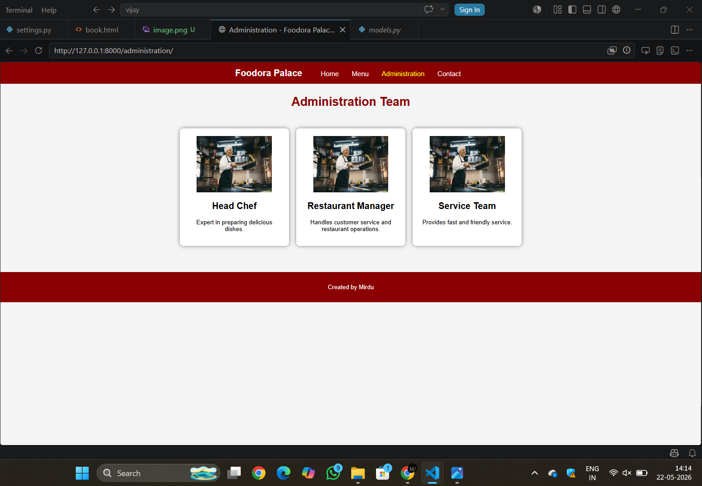
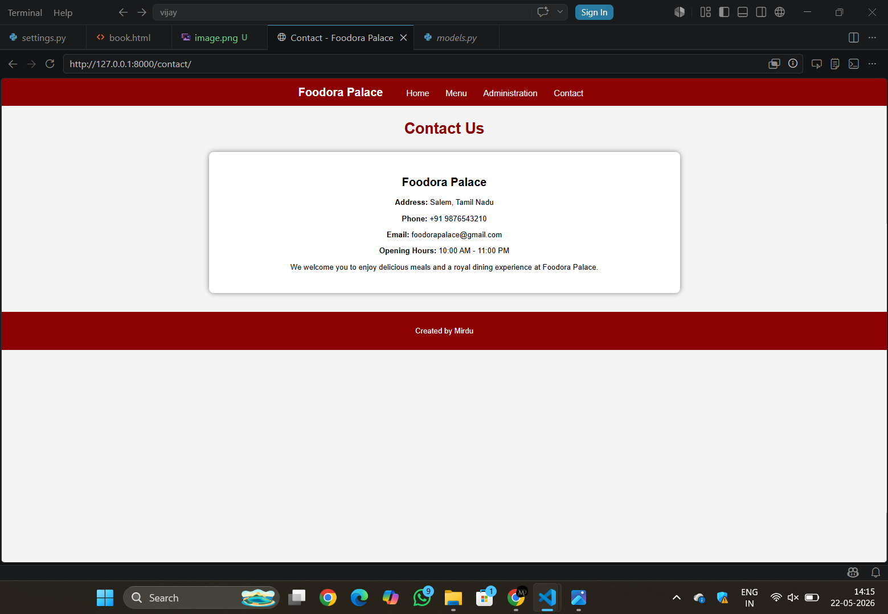

# Ex.06 Complex Problem: Restaurant Website
## Date:

## AIM:
To develop a static Restaurant website to display the food items and services provided by them.

## DESIGN STEPS:

### Step 1:
Requirement collection.

### Step 2:
Creating the layout using HTML and CSS.

### Step 3:
Updating the sample content.

### Step 4:
Choose the appropriate style and color scheme.

### Step 5:
Validate the layout in various browsers.

### Step 6:
Validate the HTML code.

### Step 7:
Publish the website in Localhost.

## PROGRAM:
home.html
```

<!DOCTYPE html>
<html>
<head>
    <title>Foodora Palace</title>

    <link rel="stylesheet" href="">
</head>

<body>

    <nav>
        <h2>Foodora Palace</h2>

        <a href="/">Home</a>
        <a href="/menu/">Menu</a>
        <a href="/administration/">Administration</a>
        <a href="/contact/">Contact</a>
    </nav>

    <section class="hero">

        

        <h1>Welcome to Foodora Palace</h1>

        <p>
            Delicious food served with love and royal taste.
        </p>

        <a href="/menu/" class="btn">View Menu</a>

    </section>

    <section class="about">

        <h2>About Us</h2>

        <p>
            Foodora Palace is a premium restaurant offering tasty Indian,
            Chinese and fast food dishes in a beautiful dining atmosphere.
        </p>

        <p>
            We provide quality food, excellent customer service and
            unforgettable dining experiences for our customers.
        </p>

    </section>

    <footer>
        <p>Created by Mirdu</p>
    </footer>

</body>
</html>
```
menu.html
```

<!DOCTYPE html>
<html>

<head>
    <title>Menu - Foodora Palace</title>

    <link rel="stylesheet" href="">
</head>

<body>

    <nav>
        <h2>Foodora Palace</h2>

        <a href="/">Home</a>
        <a href="/menu/">Menu</a>
        <a href="/administration/">Administration</a>
        <a href="/contact/">Contact</a>
    </nav>

    <h1 class="title">Our Special Menu</h1>

    <div class="menu-container">

        <div class="card">

            

            <h2>Pizza</h2>

            <p>Price: ₹250</p>

        </div>

        <div class="card">

            

            <h2>Burger</h2>

            <p>Price: ₹180</p>

        </div>

        <div class="card">

            

            <h2>Dosa</h2>

            <p>Price: ₹120</p>

        </div>

        <div class="card">

            

            <h2>Pasta</h2>

            <p>Price: ₹240</p>

        </div>

        <div class="card">

            

            <h2>French Fries</h2>

            <p>Price: ₹150</p>

        </div>

        <div class="card">

            

            <h2>Masala Dosa</h2>

            <p>Price: ₹140</p>

        </div>

    </div>

    <footer>
        <p>Created by Mirdu</p>
    </footer>

</body>

</html>
```
administration.html
```

<!DOCTYPE html>
<html>

<head>
    <title>Administration - Foodora Palace</title>

    <link rel="stylesheet" href="">
</head>

<body>

    <nav>
        <h2>Foodora Palace</h2>

        <a href="/">Home</a>
        <a href="/menu/">Menu</a>
        <a href="/administration/">Administration</a>
        <a href="/contact/">Contact</a>
    </nav>

    <h1 class="title">Administration Team</h1>

    <div class="admin-container">

        <div class="card">

            

            <h2>Head Chef</h2>

            <p>Expert in preparing delicious dishes.</p>

        </div>

        <div class="card">

            

            <h2>Restaurant Manager</h2>

            <p>Handles customer service and restaurant operations.</p>

        </div>

        <div class="card">

            

            <h2>Service Team</h2>

            <p>Provides fast and friendly service.</p>

        </div>

    </div>

    <footer>
        <p>Created by Mirdu</p>
    </footer>

</body>

</html>
```
contact.html
```

<!DOCTYPE html>
<html>

<head>
    <title>Contact - Foodora Palace</title>

    <link rel="stylesheet" href="">
</head>

<body>

    <nav>
        <h2>Foodora Palace</h2>

        <a href="/">Home</a>
        <a href="/menu/">Menu</a>
        <a href="/administration/">Administration</a>
        <a href="/contact/">Contact</a>
    </nav>

    <h1 class="title">Contact Us</h1>

    <div class="contact-box">

        <h2>Foodora Palace</h2>

        <p><b>Address:</b> Salem, Tamil Nadu</p>

        <p><b>Phone:</b> +91 9876543210</p>

        <p><b>Email:</b> foodorapalace@gmail.com</p>

        <p><b>Opening Hours:</b> 10:00 AM - 11:00 PM</p>

        <p>
            We welcome you to enjoy delicious meals and a royal dining
            experience at Foodora Palace.
        </p>

    </div>

    <footer>
        <p>Created by Mirdu</p>
    </footer>

</body>

</html>
```
style.css
```
body{
    margin:0;
    font-family: Arial, sans-serif;
    background-color:#f4f4f4;
}

nav{
    background-color:#8B0000;
    padding:15px;
    text-align:center;
}

nav h2{
    color:white;
    display:inline;
    margin-right:30px;
}

nav a{
    color:white;
    text-decoration:none;
    margin:15px;
    font-size:18px;
}

nav a:hover{
    color:yellow;
}

.hero{
    text-align:center;
    padding:100px 20px;
    background-color:#ffcccb;
}

.hero h1{
    font-size:50px;
    color:#8B0000;
}

.hero p{
    font-size:22px;
}

.btn{
    background-color:#8B0000;
    color:white;
    padding:12px 25px;
    text-decoration:none;
    border-radius:5px;
}

.btn:hover{
    background-color:black;
}

.about{
    padding:40px;
    text-align:center;
}

.title{
    text-align:center;
    color:#8B0000;
    margin-top:30px;
}

.menu-container,
.admin-container{
    display:flex;
    justify-content:center;
    flex-wrap:wrap;
    gap:20px;
    padding:30px;
}

.card{
    background:white;
    width:250px;
    padding:20px;
    border-radius:10px;
    box-shadow:0px 0px 10px gray;
    text-align:center;
}

.card:hover{
    transform:scale(1.05);
    transition:0.3s;
}

.contact-box{
    width:50%;
    margin:auto;
    background:white;
    padding:30px;
    border-radius:10px;
    box-shadow:0px 0px 10px gray;
    margin-top:30px;
    text-align:center;
}

footer{
    background-color:#8B0000;
    color:white;
    text-align:center;
    padding:15px;
    margin-top:40px;
}
```
## OUTPUT:






DEVELOPED BY: MIRDULA D

REGISTRATION NO. 212225040234


## RESULT:
The program for designing software company website using HTML and CSS is completed successfully.
